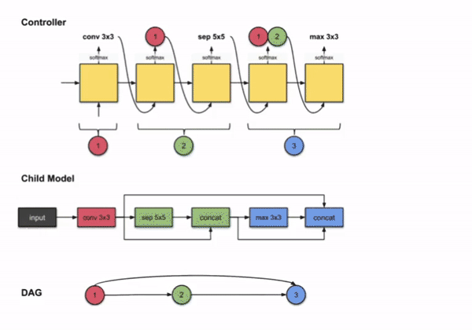

# Experimentally-Assessing-the-Controllers-for-Neural-Architecture-Search-
Neural networks are powerful and flexible models that work well for many complicated tasks such as computer vision, text &amp; speech processing, combinatorialoptimization problems and etc. “AI that creates AI”, was a common headline ofwhat people initially described as Automated Machine Learning (i.e. Auto ML).This novel concept gained attraction in 2016 when Google Brain released theirfirst “Neural Architecture Search with Reinforcement Learning (NAS)”. Tradi-tionally, choosing a neural network architecture manually is a tiring, inefficient &amp;computationally expensive task. Even the standard NAS is very computationallyexpensive as it required over 450 GPU’s for 3-4 days to train on CIFAR-10. Weare analyzing &amp; reproducing the method of standard Neural Architecture Search(NAS) through an existing improved method known as “Efficient Neural Archi-tecture Search via Parameter Sharing (ENAS)”. We are assessing the quality ofthe ENAS architectures’ RNN controller using different experimental techniquessuch assearch space poisoning and random search to see how the controllerperforms when decoupled with strong search spaces.
#### Please drop a star if you find this helpful or atleast mildly exciting ;)

### Macro Search on the architecture looks like:

